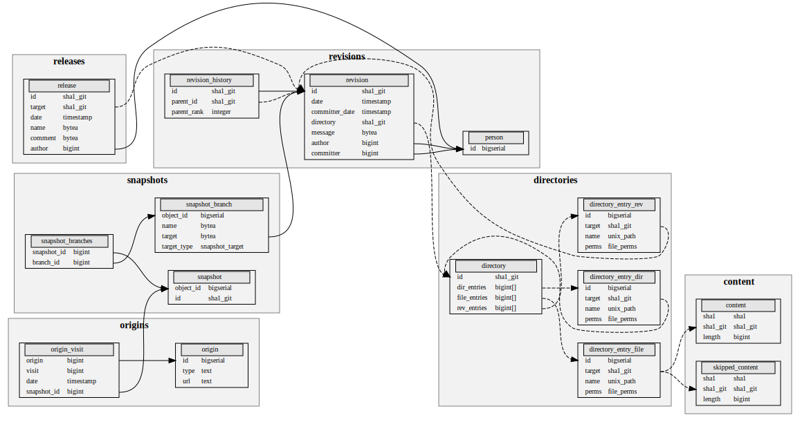

Relational schema
=================

The Merkle DAG of the Software Heritage archive is encoded in the dataset as a
set of relational tables.
A simplified view of the corresponding database schema is shown here:

This page documents the details of the schema.

-  **content**: contains information on the contents stored in
   the archive.

    - ``sha1`` (bytes): the SHA-1 of the content
    - ``sha1_git`` (bytes): the Git SHA-1 of the content
    - ``length`` (integer): the length of the content

-  **skipped_content**: contains information on the contents that were not archived for
  various reasons.

    - ``sha1`` (bytes): the SHA-1 of the missing content
    - ``sha1_git`` (bytes): the Git SHA-1 of the missing content
    - ``length`` (integer): the length of the missing content

- **directory**: contains the directories stored in the archive.

    - ``id`` (bytes): the intrinsic identifier of the directory, recursively
      computed with the Git SHA-1 algorithm
    - ``dir_entries`` (array of integers): the list of directories contained in
      this directory, as references to an entry in the ``directory_entry_dir``
      table.
    - ``file_entries`` (array of integers): the list of files contained in
      this directory, as references to an entry in the ``directory_entry_file``
      table.
    - ``rev_entries`` (array of integers): the list of revisions contained in
      this directory, as references to an entry in the ``directory_entry_rev``
      table.

- **directory_entry_file**: contains informations about file entries in
  directories.

    - ``id`` (integer): unique identifier for the entry
    - ``target`` (bytes): the Git SHA-1 of the content this entry points to
    - ``name`` (bytes): the name of the file (basename of its path)
    - ``perms`` (integer): the permissions of the file

- **directory_entry_dir**: contains informations about directory entries in
  directories.

    - ``id`` (integer): unique identifier for the entry
    - ``target`` (bytes): the Git SHA-1 of the directory this entry points to
    - ``name`` (bytes): the name of the directory
    - ``perms`` (integer): the permissions of the directory

- **directory_entry_rev**: contains informations about revision entries in
  directories.

    - ``id`` (integer): unique identifier for the entry
    - ``target`` (bytes): the Git SHA-1 of the revision this entry points to
    - ``name`` (bytes): the name of the directory that contains this revision
    - ``perms`` (integer): the permissions of the revision

- **revision**: contains the revisions stored in the archive.

    - ``id`` (bytes): the intrinsic identifier of the revision, recursively
      computed with the Git SHA-1 algorithm. For Git repositories, this
      corresponds to the commit hash.

-  The ``revision`` table contains all the revisions, identified by
   their intrinsic hash in the ``id`` field. Each revision points to the
   root directory of the project source tree, identified by the
   ``directory`` field which references the ``sha1_git`` cryptographic
   hash of the directory. The table also contains metadata on the
   revisions, notably the ``author`` and ``committer`` fields, the
   ``date`` and ``committer_date`` fields and the ``message`` field.

   Each revision has an ordered set of parents (0 for the initial commit
   of a repository, 1 for a normal commit and 2 or more for a merge
   commit). These parents are stored in the ``revision_history`` table,
   one row per parent. Each parent is identified by the ``id``
   identifier, pointing to the hash of the revision, the ``parent_id``
   identifier, pointing to the hash of the parent revision, and the
   ``parent_rank`` integer which defines the order of the parents of
   each revision.

-  The ``person`` table deduplicates commit authors by their name and
   e-mail addresses. For pseudonymization purposes and in order to
   prevent abuse, these columns were removed from the dataset, and this
   table only contains the ``id`` column referenced by the ``author``
   and ``committer`` fields of the ``revision`` table. Individual
   authors may be retrieved using this ID from the Software Heritage
   api.

-  The ``release`` table contains the releases in the archive. They are
   also identified by their intrinsic hash ``id`` and point to a
   revision referenced by its hash in the ``target`` field. The metadata
   fields are semantically similar to the ``revision`` table (i.e
   ``author``, ``date``, ``message``).

-  The ``snapshot`` table contains the list of snapshots identified by
   their intrinsic hash ``id``, and their integer primary key in the
   archive ``object_id``. Each snapshot maps to a list of branches
   listed in the table ``snapshot_branch`` through the many-to-many
   relationship intermediate table ``snapshot_branches``, which
   references the ``object_id`` fields of the ``snapshot`` and
   ``snapshot_branch`` tables. The ``snapshot_branch`` table also
   contains the ``name`` of the branch and the ``target`` it points to
   (identified by its intrinsic hash), either a ``release``,
   ``revision``, ``directory`` or ``content`` object depending on the
   value of the ``target_type`` field.

In addition to the nodes and edges of the graph, the dataset also
contains crawling information, as a set of triples capturing where (an
origin url) and when (a timestamp) a given snapshot has been
encountered.

-  The ``origin`` table contains the origins from which the software
   projects in the dataset were archived, identified by their ``id``
   identifier, and ``type`` and ``url`` metadata.

   Since Software Heritage archives software continuously, software
   origins are crawled more than once. Every “visit” of an origin is
   stored in the ``origin_visit`` table, which contains the identifier
   ``origin`` of the origin visited, the ``date`` of the visit and a
   ``snapshot_id`` integer which points to the ``object_id`` identifier
   of the ``snapshot`` table.

